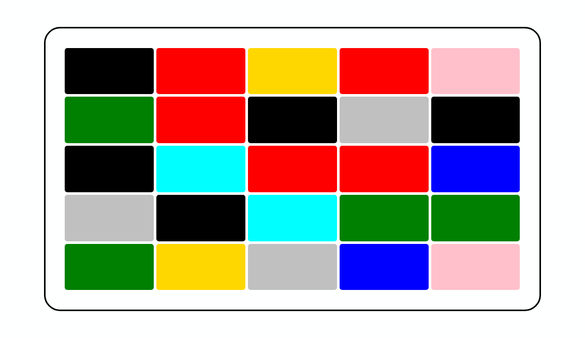

# Colors-Table-React

### This NPM package offers a visually stunning and interactive table component, created with ReactJS, JavaScript, and SASS, that is perfect for gaming applications. With its dynamic color-changing capabilities and responsive layout, this component is designed to enhance user engagement and add excitement to any project. Whether you're a game developer or simply looking to enhance the visual appeal of your app, this table component is the perfect solution for creating an immersive and engaging user experience. <br />


---

## Configuration Options

### The colors-table component offers a variety of configuration options to customize its appearance and functionality, including:

- **rows\columns**: The table's rows/columns count can be configured for your own desire.
- **allowRepeatedColors**: This prop allow you to decide whether you want the clicked item's color to be able to repeat after a click.
- **colors**: The table's color list to pick from at the time when the table is generated initially, and at any time an item's color changes inside the table.
- **backgroundColor**: Its optional to use specific background color for the table.
- **onChange**: This prop allow you to pass an onChange function to the table in order to allow this component to be used in a lot of ways, and in a lot of concepts.

</br>

## Usage

**Example of using the table in react app file, customized with the mentioned props**:

```js
import React from "react";
import { ManagedColorsTable } from "colors-table-react";

function App() {
  return (
    <div className="app-container">
      <ManagedColorsTable
        rows={5}
        columns={7}
        allowRepeatedColors={false}
        colors={MY_COLORS_LIST}
        backgroundColor="wheat"
        onChange={() => console.log("change-detected!")}
      />
    </div>
  );
}

export default App;
```

**Installation:**</br>
run the following command on your terminal:</br> _`npm install colors-table-react`_

---

### **Example of using the table component:**



---

## Author

:octocat: **Afek Sakaju**

- LinkedIn: [@afeksa](https://www.linkedin.com/in/afeksa/)
- GitHub: [@afekTheMiniLearner](https://github.com/afekTheMiniLearner)
